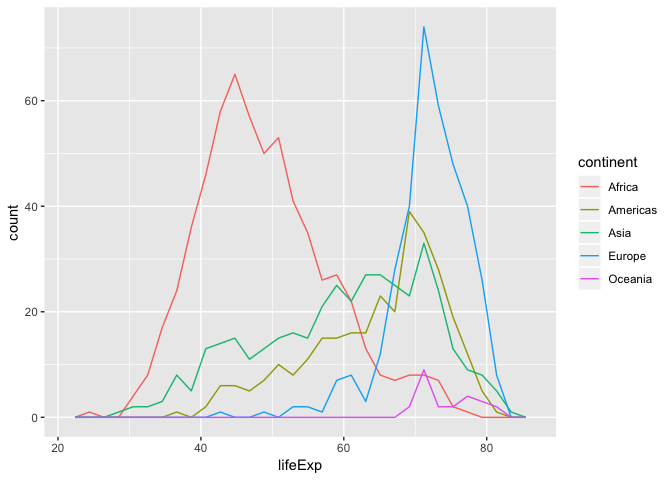

Alejandra\_hw02\_gapminder\_dplyr
================

## Gapminder exploration and use of dplyr

This is an R Markdown document used for exploring the gapminder dataset
through the functions of the dplyr package. This document is intented to
serve as a “cheatsheet” for future work on R.

## Loading data

``` r
library(gapminder)
library(tidyverse)
```

    ## ── Attaching packages ─────────────────────────────────────────────────────────────────────────────────────────────────────────────────────────────── tidyverse 1.2.1 ──

    ## ✔ ggplot2 3.0.0     ✔ purrr   0.2.5
    ## ✔ tibble  1.4.2     ✔ dplyr   0.7.6
    ## ✔ tidyr   0.8.1     ✔ stringr 1.3.1
    ## ✔ readr   1.1.1     ✔ forcats 0.3.0

    ## ── Conflicts ────────────────────────────────────────────────────────────────────────────────────────────────────────────────────────────────── tidyverse_conflicts() ──
    ## ✖ dplyr::filter() masks stats::filter()
    ## ✖ dplyr::lag()    masks stats::lag()

``` r
library(knitr)
```

## Smell test the data

**Is it a data.frame, a matrix, a vector, a list?**

``` r
gapminder
```

    ## # A tibble: 1,704 x 6
    ##    country     continent  year lifeExp      pop gdpPercap
    ##    <fct>       <fct>     <int>   <dbl>    <int>     <dbl>
    ##  1 Afghanistan Asia       1952    28.8  8425333      779.
    ##  2 Afghanistan Asia       1957    30.3  9240934      821.
    ##  3 Afghanistan Asia       1962    32.0 10267083      853.
    ##  4 Afghanistan Asia       1967    34.0 11537966      836.
    ##  5 Afghanistan Asia       1972    36.1 13079460      740.
    ##  6 Afghanistan Asia       1977    38.4 14880372      786.
    ##  7 Afghanistan Asia       1982    39.9 12881816      978.
    ##  8 Afghanistan Asia       1987    40.8 13867957      852.
    ##  9 Afghanistan Asia       1992    41.7 16317921      649.
    ## 10 Afghanistan Asia       1997    41.8 22227415      635.
    ## # ... with 1,694 more rows

``` r
typeof(gapminder)
```

    ## [1] "list"

When printing `gapminder` I can see the variables of the data set are
arranged in columns and the observations of these variables are arranged
in rows. This is a two dimensional object that holds different types of
data. I know this object is a data frame.

The function `typeof()` determines the (R internal) type or storage mode
of an object. The type of this data set is a **list**. A list in R
allows to gather a variety of objects under one name in an ordered way.
These objects can be matrices, vectors, data frames, other lists, etc.

**What is its class?**

``` r
class(gapminder)
```

    ## [1] "tbl_df"     "tbl"        "data.frame"

The `class()`function confirms that gapminder is a data frame. :+1:

**How many variables/columns?**

``` r
ncol(gapminder)
```

    ## [1] 6

**How many rows/observations?**

``` r
nrow(gapminder)
```

    ## [1] 1704

`ncol()` and `nrow()` functions return the number of columns and rows,
respectively.

**Can you get these facts about “extent” or “size” in more than one way?
Can you imagine different functions being useful in different
contexts?**

``` r
dim(gapminder) #rows, columns
```

    ## [1] 1704    6

``` r
length(gapminder) #Number of columns
```

    ## [1] 6

I can get the same information with `dim()` function, the output is
(number of rows, number of columns). Functions are useful depending on
what we want to look at. If I just want to know how big is my dataset
dim() is great, if I for example want to iterate, on either columns or
rows, then ncol or nrow would be sufficient.

**What data type is each variable?**

``` r
lapply(gapminder,class) %>%
  as.matrix() %>%
  kable(col.names = "Data type",align = 'lc')
```

|           | Data type |
| --------- | :-------- |
| country   | factor    |
| continent | factor    |
| year      | integer   |
| lifeExp   | numeric   |
| pop       | integer   |
| gdpPercap | numeric   |

I can also get all the above information with `str()`
    function:

``` r
str(gapminder)
```

    ## Classes 'tbl_df', 'tbl' and 'data.frame':    1704 obs. of  6 variables:
    ##  $ country  : Factor w/ 142 levels "Afghanistan",..: 1 1 1 1 1 1 1 1 1 1 ...
    ##  $ continent: Factor w/ 5 levels "Africa","Americas",..: 3 3 3 3 3 3 3 3 3 3 ...
    ##  $ year     : int  1952 1957 1962 1967 1972 1977 1982 1987 1992 1997 ...
    ##  $ lifeExp  : num  28.8 30.3 32 34 36.1 ...
    ##  $ pop      : int  8425333 9240934 10267083 11537966 13079460 14880372 12881816 13867957 16317921 22227415 ...
    ##  $ gdpPercap: num  779 821 853 836 740 ...

## Explore individual variables

Here I explore the categorical variable `country` and the quantitative
variable `lifeExp`.

### country

I would like to know how many countries are stored within `country`:

``` r
n_distinct(gapminder$country)
```

    ## [1] 142

Another way to do this is and to get all the unique values (all
countries) is by using `unique()`:

``` r
unique(gapminder$country)
```

    ##   [1] Afghanistan              Albania                 
    ##   [3] Algeria                  Angola                  
    ##   [5] Argentina                Australia               
    ##   [7] Austria                  Bahrain                 
    ##   [9] Bangladesh               Belgium                 
    ##  [11] Benin                    Bolivia                 
    ##  [13] Bosnia and Herzegovina   Botswana                
    ##  [15] Brazil                   Bulgaria                
    ##  [17] Burkina Faso             Burundi                 
    ##  [19] Cambodia                 Cameroon                
    ##  [21] Canada                   Central African Republic
    ##  [23] Chad                     Chile                   
    ##  [25] China                    Colombia                
    ##  [27] Comoros                  Congo, Dem. Rep.        
    ##  [29] Congo, Rep.              Costa Rica              
    ##  [31] Cote d'Ivoire            Croatia                 
    ##  [33] Cuba                     Czech Republic          
    ##  [35] Denmark                  Djibouti                
    ##  [37] Dominican Republic       Ecuador                 
    ##  [39] Egypt                    El Salvador             
    ##  [41] Equatorial Guinea        Eritrea                 
    ##  [43] Ethiopia                 Finland                 
    ##  [45] France                   Gabon                   
    ##  [47] Gambia                   Germany                 
    ##  [49] Ghana                    Greece                  
    ##  [51] Guatemala                Guinea                  
    ##  [53] Guinea-Bissau            Haiti                   
    ##  [55] Honduras                 Hong Kong, China        
    ##  [57] Hungary                  Iceland                 
    ##  [59] India                    Indonesia               
    ##  [61] Iran                     Iraq                    
    ##  [63] Ireland                  Israel                  
    ##  [65] Italy                    Jamaica                 
    ##  [67] Japan                    Jordan                  
    ##  [69] Kenya                    Korea, Dem. Rep.        
    ##  [71] Korea, Rep.              Kuwait                  
    ##  [73] Lebanon                  Lesotho                 
    ##  [75] Liberia                  Libya                   
    ##  [77] Madagascar               Malawi                  
    ##  [79] Malaysia                 Mali                    
    ##  [81] Mauritania               Mauritius               
    ##  [83] Mexico                   Mongolia                
    ##  [85] Montenegro               Morocco                 
    ##  [87] Mozambique               Myanmar                 
    ##  [89] Namibia                  Nepal                   
    ##  [91] Netherlands              New Zealand             
    ##  [93] Nicaragua                Niger                   
    ##  [95] Nigeria                  Norway                  
    ##  [97] Oman                     Pakistan                
    ##  [99] Panama                   Paraguay                
    ## [101] Peru                     Philippines             
    ## [103] Poland                   Portugal                
    ## [105] Puerto Rico              Reunion                 
    ## [107] Romania                  Rwanda                  
    ## [109] Sao Tome and Principe    Saudi Arabia            
    ## [111] Senegal                  Serbia                  
    ## [113] Sierra Leone             Singapore               
    ## [115] Slovak Republic          Slovenia                
    ## [117] Somalia                  South Africa            
    ## [119] Spain                    Sri Lanka               
    ## [121] Sudan                    Swaziland               
    ## [123] Sweden                   Switzerland             
    ## [125] Syria                    Taiwan                  
    ## [127] Tanzania                 Thailand                
    ## [129] Togo                     Trinidad and Tobago     
    ## [131] Tunisia                  Turkey                  
    ## [133] Uganda                   United Kingdom          
    ## [135] United States            Uruguay                 
    ## [137] Venezuela                Vietnam                 
    ## [139] West Bank and Gaza       Yemen, Rep.             
    ## [141] Zambia                   Zimbabwe                
    ## 142 Levels: Afghanistan Albania Algeria Angola Argentina ... Zimbabwe

### lifeExp

For the life expectancy variable I would like to know the range of the
values:

``` r
range(gapminder$lifeExp)
```

    ## [1] 23.599 82.603

The range, quartiles, median, and mean can all be obtained through
`summary()`:

``` r
summary(gapminder$lifeExp)
```

    ##    Min. 1st Qu.  Median    Mean 3rd Qu.    Max. 
    ##   23.60   48.20   60.71   59.47   70.85   82.60

Know I want to look at the distribution of `lifeExp` by combining the
histogram of the variable and a Kernel density plot.

``` r
ggplot(gapminder, aes(lifeExp)) +
         geom_histogram(aes(y=..density..),fill = "cornflowerblue", bins=50) +
  geom_density()
```

<!-- -->
The histogram shows two main peaks, where the most values are found: the
biggest one around 70 years and the other one, close to 50 years.

## Explore various plot types

### A scatterplot of two quantitative variables

In this section I will explore gdpPercap as a function of lifeExp:

``` r
  ggplot(gapminder, aes(lifeExp,gdpPercap, color=continent)) +
    geom_point(aes(alpha=year)) +
    scale_y_log10()
```

<!-- -->

In the above graph I used transparency to differentiate the year of the
data. Now, I will just use the last year of data, which is 2007:

``` r
a<-gapminder%>%
  filter(year == 2007)
a
```

    ## # A tibble: 142 x 6
    ##    country     continent  year lifeExp       pop gdpPercap
    ##    <fct>       <fct>     <int>   <dbl>     <int>     <dbl>
    ##  1 Afghanistan Asia       2007    43.8  31889923      975.
    ##  2 Albania     Europe     2007    76.4   3600523     5937.
    ##  3 Algeria     Africa     2007    72.3  33333216     6223.
    ##  4 Angola      Africa     2007    42.7  12420476     4797.
    ##  5 Argentina   Americas   2007    75.3  40301927    12779.
    ##  6 Australia   Oceania    2007    81.2  20434176    34435.
    ##  7 Austria     Europe     2007    79.8   8199783    36126.
    ##  8 Bahrain     Asia       2007    75.6    708573    29796.
    ##  9 Bangladesh  Asia       2007    64.1 150448339     1391.
    ## 10 Belgium     Europe     2007    79.4  10392226    33693.
    ## # ... with 132 more rows

``` r
ggplot(a, aes(lifeExp,gdpPercap, color=continent)) +
    geom_point() +
    scale_y_log10()
```

<!-- -->
This graph presents data from only one year. It is easily appreciated
the difference overall between lifeExp and gdpPercap in African
countries where it is lower than in Europe and Oceania.

### A plot of one quantitative variable.

Now, I will look at the lifeExp data arranged by continent with a
frequency polygon:

``` r
ggplot(gapminder, aes(lifeExp, color=continent)) +
  geom_freqpoly()
```

    ## `stat_bin()` using `bins = 30`. Pick better value with `binwidth`.

<!-- -->
This plot shows the frequency of life expectancy values within the
dataset. We can see a discrepancy between the most common values for
life expectancy in Africa and Europe.

And now lets look at the distribution of this same variable among
continents.

``` r
ggplot(gapminder, aes(lifeExp, fill=continent)) +
  geom_density(alpha=0.3)
```

<!-- -->
In this plot it is easily appreciated that Europe and Oceania present a
more homogenous distribution of life expectancy, while the rest of the
continents have a wider range of values, probably because of bigger
socio-economic gaps between countries.

### Plot of one quantitative variable and one categorical.

First, I will arrange my data:

``` r
# for the gapminder, group by continent
# to show the average Life Expectancy (LE) per continent
LEbyCont <- gapminder %>% 
  group_by(continent) %>% 
  summarize(avgLE = mean(lifeExp)) 

kable(LEbyCont, #Table to plot
      col.names = c('Continent', 'Avg. Life Expectancy'), #name the columns
      digits = 1, #round to 1 decimal
      align = 'lc') #Column alignment 'lc' is for the first column left aligned 'l', and second centered 'c'
```

| Continent | Avg. Life Expectancy |
| :-------- | :------------------: |
| Africa    |         48.9         |
| Americas  |         64.7         |
| Asia      |         60.1         |
| Europe    |         71.9         |
| Oceania   |         74.3         |

``` r
#LEbyCont
```

Now I will do the plot to present average of life expectancy in each
continent.

``` r
# plot the avg Life Expectancy for each continent

LEbyCont <- LEbyCont %>% mutate(avgLE = round(avgLE, 1)) #round numbers of Avg. Life Expectancy
ggplot(LEbyCont, #table to plot
  aes(x = continent, y = avgLE, color = continent, label = avgLE)) +  #aesthetic mappings and select the AvgLE as the     labels on the plot
  geom_point(size=4) + #size of points in the plot
  ggtitle("Life Expectancy by Continent") +  #title of the plot
  xlab("Continent") + ylab("Avg. Life Expectancy (years)") + #x and y labels
  geom_text(aes(label=avgLE),hjust=-0.3, vjust=0)#adjust the place of the labels
```

<!-- -->

Here, it is easily appreciated the overall difference of the average
life expectancy between continents.

``` r
g1 <- ggplot(gapminder, aes(continent, pop, fill = continent)) +
      geom_boxplot() +
      scale_y_log10() +
      theme(legend.position = "none", axis.text.x = element_text(angle = 45, hjust = 1)) +
      xlab("")
g2 <- ggplot(gapminder, aes(continent, lifeExp, fill = continent)) +
      geom_boxplot()+
      theme(legend.title = element_blank(), legend.position="none", axis.text.x = element_text(angle = 45, hjust = 1))+
      xlab("") +
      scale_y_continuous(breaks = seq(0,90,by=10))
plot_grid(g1, g2) #used plot_grid to put plots together
```

<!-- -->

The boxplots show population and life expectancy variables for all the
continents. We can see a wide spread distribution of both variables
mostly in Asia and Africa. Although there are distinct outliers in both
plots, I was particularly interested on the outlier in Africa, where
life expectancy is very low.

## Use filter(), select() and %\>%

So let’s try to find that data point:

``` r
x<-gapminder %>%
  filter(continent %in% "Africa", lifeExp<30) %>%
  select(country,lifeExp, year)
x
```

    ## # A tibble: 1 x 3
    ##   country lifeExp  year
    ##   <fct>     <dbl> <int>
    ## 1 Rwanda     23.6  1992

After finding this very low value of life expectancy in Rwanda in 1992,
I researched a bit for an explanation of this, and learnt about the
Rwandan Civil War during which many people were killed and therefore,
the impact on this variable.

I want to see how life expectancy in Rwanda behaved before and after
this event:

``` r
gapminder%>%
  filter(country %in% c("Rwanda")) %>%
  select(lifeExp, year) %>%
  ggplot(aes(year,lifeExp)) +
  ggtitle("Historical Life Expectancy in Rwanda") +
  geom_point(color="red") +
  geom_path(alpha=0.2)
```

<!-- -->
We can see that before this event, the trend of life expectancy was to
go higher, but becaise of this terrible event, life expectancy drop
dramatically and took about 20 years to recover.

I suspect this event also impacted the variable of population:

``` r
gapminder%>%
  filter(country %in% c("Rwanda")) %>%
  select(pop, year) %>%
  ggplot(aes(year,pop)) +
  ggtitle("Historical population in Rwanda") +
  geom_point(color="red") +
  geom_path(alpha=0.2)
```

<!-- -->
In this graph we can see that not only the population didn’t grow but it
even decreased during this period of Rwanda’s history.

## But I want to do more\!

Evaluate this code and describe the result. Presumably the analyst’s
intent was to get the data for Rwanda and Afghanistan. Did they succeed?
Why or why not? If not, what is the correct way to do this?

``` r
filter(gapminder, country == c("Rwanda", "Afghanistan")) %>%
  kable(.)
```

| country     | continent | year | lifeExp |      pop | gdpPercap |
| :---------- | :-------- | ---: | ------: | -------: | --------: |
| Afghanistan | Asia      | 1957 |  30.332 |  9240934 |  820.8530 |
| Afghanistan | Asia      | 1967 |  34.020 | 11537966 |  836.1971 |
| Afghanistan | Asia      | 1977 |  38.438 | 14880372 |  786.1134 |
| Afghanistan | Asia      | 1987 |  40.822 | 13867957 |  852.3959 |
| Afghanistan | Asia      | 1997 |  41.763 | 22227415 |  635.3414 |
| Afghanistan | Asia      | 2007 |  43.828 | 31889923 |  974.5803 |
| Rwanda      | Africa    | 1952 |  40.000 |  2534927 |  493.3239 |
| Rwanda      | Africa    | 1962 |  43.000 |  3051242 |  597.4731 |
| Rwanda      | Africa    | 1972 |  44.600 |  3992121 |  590.5807 |
| Rwanda      | Africa    | 1982 |  46.218 |  5507565 |  881.5706 |
| Rwanda      | Africa    | 1992 |  23.599 |  7290203 |  737.0686 |
| Rwanda      | Africa    | 2002 |  43.413 |  7852401 |  785.6538 |

When running this code, I can see that some years of data are missing,
since == is a logical operator that compares two things that are the
same length. So in this sense, as we have 12 years of data 6 and 6 go to
each country. So if we add a third country, 4 years would be displayed
for each one as shown below:

``` r
filter(gapminder, country == c("Rwanda", "Afghanistan", "Mexico")) %>%
  kable(.)
```

| country     | continent | year | lifeExp |       pop |  gdpPercap |
| :---------- | :-------- | ---: | ------: | --------: | ---------: |
| Afghanistan | Asia      | 1957 |  30.332 |   9240934 |   820.8530 |
| Afghanistan | Asia      | 1972 |  36.088 |  13079460 |   739.9811 |
| Afghanistan | Asia      | 1987 |  40.822 |  13867957 |   852.3959 |
| Afghanistan | Asia      | 2002 |  42.129 |  25268405 |   726.7341 |
| Mexico      | Americas  | 1962 |  58.299 |  41121485 |  4581.6094 |
| Mexico      | Americas  | 1977 |  65.032 |  63759976 |  7674.9291 |
| Mexico      | Americas  | 1992 |  71.455 |  88111030 |  9472.3843 |
| Mexico      | Americas  | 2007 |  76.195 | 108700891 | 11977.5750 |
| Rwanda      | Africa    | 1952 |  40.000 |   2534927 |   493.3239 |
| Rwanda      | Africa    | 1967 |  44.100 |   3451079 |   510.9637 |
| Rwanda      | Africa    | 1982 |  46.218 |   5507565 |   881.5706 |
| Rwanda      | Africa    | 1997 |  36.087 |   7212583 |   589.9445 |

To extract all the data from Rwanda and Afghanistan, the analyst should
use `%in%` operator instead. Let’s try it:

``` r
filter(gapminder, country %in% c("Rwanda", "Afghanistan")) %>%
  kable(.)
```

| country     | continent | year | lifeExp |      pop | gdpPercap |
| :---------- | :-------- | ---: | ------: | -------: | --------: |
| Afghanistan | Asia      | 1952 |  28.801 |  8425333 |  779.4453 |
| Afghanistan | Asia      | 1957 |  30.332 |  9240934 |  820.8530 |
| Afghanistan | Asia      | 1962 |  31.997 | 10267083 |  853.1007 |
| Afghanistan | Asia      | 1967 |  34.020 | 11537966 |  836.1971 |
| Afghanistan | Asia      | 1972 |  36.088 | 13079460 |  739.9811 |
| Afghanistan | Asia      | 1977 |  38.438 | 14880372 |  786.1134 |
| Afghanistan | Asia      | 1982 |  39.854 | 12881816 |  978.0114 |
| Afghanistan | Asia      | 1987 |  40.822 | 13867957 |  852.3959 |
| Afghanistan | Asia      | 1992 |  41.674 | 16317921 |  649.3414 |
| Afghanistan | Asia      | 1997 |  41.763 | 22227415 |  635.3414 |
| Afghanistan | Asia      | 2002 |  42.129 | 25268405 |  726.7341 |
| Afghanistan | Asia      | 2007 |  43.828 | 31889923 |  974.5803 |
| Rwanda      | Africa    | 1952 |  40.000 |  2534927 |  493.3239 |
| Rwanda      | Africa    | 1957 |  41.500 |  2822082 |  540.2894 |
| Rwanda      | Africa    | 1962 |  43.000 |  3051242 |  597.4731 |
| Rwanda      | Africa    | 1967 |  44.100 |  3451079 |  510.9637 |
| Rwanda      | Africa    | 1972 |  44.600 |  3992121 |  590.5807 |
| Rwanda      | Africa    | 1977 |  45.000 |  4657072 |  670.0806 |
| Rwanda      | Africa    | 1982 |  46.218 |  5507565 |  881.5706 |
| Rwanda      | Africa    | 1987 |  44.020 |  6349365 |  847.9912 |
| Rwanda      | Africa    | 1992 |  23.599 |  7290203 |  737.0686 |
| Rwanda      | Africa    | 1997 |  36.087 |  7212583 |  589.9445 |
| Rwanda      | Africa    | 2002 |  43.413 |  7852401 |  785.6538 |
| Rwanda      | Africa    | 2007 |  46.242 |  8860588 |  863.0885 |

Now we have all the data from both countries :thumbsup:
