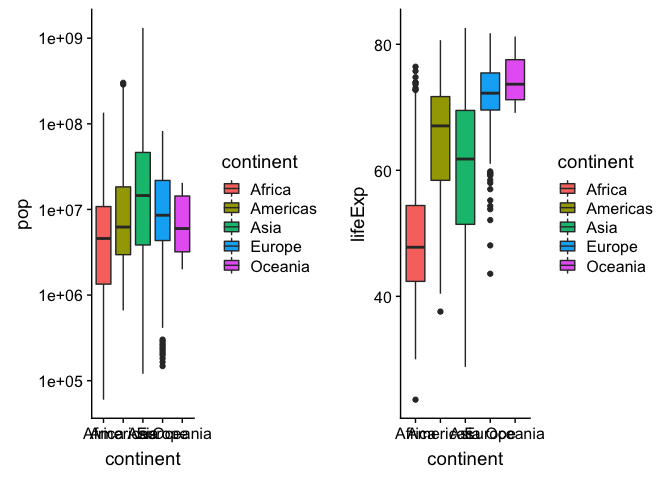
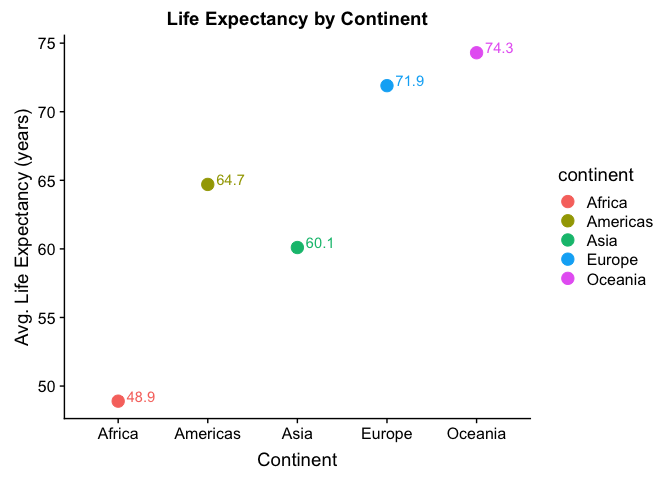

Alejandra\_hw02\_gapminder\_dplyr
================

\#Gapminder exploration and use of dplyr This is an R Markdown document
used for exploring the gapminder dataset through the functions of the
dplyr package. This document is intented to serve as a “cheatsheet” for
future work on R.

\#\#Loading data

``` r
library(gapminder)
library(tidyverse)
```

    ## ── Attaching packages ────────────────────────────────────────────────────────────── tidyverse 1.2.1 ──

    ## ✔ ggplot2 3.0.0     ✔ purrr   0.2.5
    ## ✔ tibble  1.4.2     ✔ dplyr   0.7.6
    ## ✔ tidyr   0.8.1     ✔ stringr 1.3.1
    ## ✔ readr   1.1.1     ✔ forcats 0.3.0

    ## ── Conflicts ───────────────────────────────────────────────────────────────── tidyverse_conflicts() ──
    ## ✖ dplyr::filter() masks stats::filter()
    ## ✖ dplyr::lag()    masks stats::lag()

``` r
library(knitr)
```

## Smell test the data

Is it a data.frame, a matrix, a vector, a list?

``` r
gapminder
```

    ## # A tibble: 1,704 x 6
    ##    country     continent  year lifeExp      pop gdpPercap
    ##    <fct>       <fct>     <int>   <dbl>    <int>     <dbl>
    ##  1 Afghanistan Asia       1952    28.8  8425333      779.
    ##  2 Afghanistan Asia       1957    30.3  9240934      821.
    ##  3 Afghanistan Asia       1962    32.0 10267083      853.
    ##  4 Afghanistan Asia       1967    34.0 11537966      836.
    ##  5 Afghanistan Asia       1972    36.1 13079460      740.
    ##  6 Afghanistan Asia       1977    38.4 14880372      786.
    ##  7 Afghanistan Asia       1982    39.9 12881816      978.
    ##  8 Afghanistan Asia       1987    40.8 13867957      852.
    ##  9 Afghanistan Asia       1992    41.7 16317921      649.
    ## 10 Afghanistan Asia       1997    41.8 22227415      635.
    ## # ... with 1,694 more rows

``` r
typeof(gapminder)
```

    ## [1] "list"

When printing `gapminder` I can see the variables of the data set are
arranged in columns and the observations of these variables are arranged
in rows. This is a two dimensional object that holds different types of
data. I know this object is a data frame.

The function `typeof()` determines the (R internal) type or storage mode
of an object. The type of this data set is a **list**. A list in R
allows to gather a variety of objects under one name in an ordered way.
These objects can be matrices, vectors, data frames, other lists, etc.

What is its class?

``` r
class(gapminder)
```

    ## [1] "tbl_df"     "tbl"        "data.frame"

The `class()`function confirms that gapminder is a data frame. :+1:

How many variables/columns?

``` r
ncol(gapminder)
```

    ## [1] 6

How many rows/observations?

``` r
nrow(gapminder)
```

    ## [1] 1704

`ncol()` and `nrow()` functions return the number of columns and rows,
respectively.

Can you get these facts about “extent” or “size” in more than one way?
Can you imagine different functions being useful in different contexts?

``` r
dim(gapminder)
```

    ## [1] 1704    6

I can get the same information with `dim()` function, the output is
(number of rows, number of columns).

What data type is each variable?

``` r
lapply(gapminder,class)
```

    ## $country
    ## [1] "factor"
    ## 
    ## $continent
    ## [1] "factor"
    ## 
    ## $year
    ## [1] "integer"
    ## 
    ## $lifeExp
    ## [1] "numeric"
    ## 
    ## $pop
    ## [1] "integer"
    ## 
    ## $gdpPercap
    ## [1] "numeric"

I can also get all the above information with `str()`
    function:

``` r
str(gapminder)
```

    ## Classes 'tbl_df', 'tbl' and 'data.frame':    1704 obs. of  6 variables:
    ##  $ country  : Factor w/ 142 levels "Afghanistan",..: 1 1 1 1 1 1 1 1 1 1 ...
    ##  $ continent: Factor w/ 5 levels "Africa","Americas",..: 3 3 3 3 3 3 3 3 3 3 ...
    ##  $ year     : int  1952 1957 1962 1967 1972 1977 1982 1987 1992 1997 ...
    ##  $ lifeExp  : num  28.8 30.3 32 34 36.1 ...
    ##  $ pop      : int  8425333 9240934 10267083 11537966 13079460 14880372 12881816 13867957 16317921 22227415 ...
    ##  $ gdpPercap: num  779 821 853 836 740 ...

## Explore individual variables

Here I explore the categorical variable `country` and the quantitative
variable `lifeExp`.

### country

I would like to know how many countries are stored within `country`:

``` r
n_distinct(gapminder$country)
```

    ## [1] 142

Another way to do this is and to get all the unique values (all
countries) is:

``` r
unique(gapminder$country)
```

    ##   [1] Afghanistan              Albania                 
    ##   [3] Algeria                  Angola                  
    ##   [5] Argentina                Australia               
    ##   [7] Austria                  Bahrain                 
    ##   [9] Bangladesh               Belgium                 
    ##  [11] Benin                    Bolivia                 
    ##  [13] Bosnia and Herzegovina   Botswana                
    ##  [15] Brazil                   Bulgaria                
    ##  [17] Burkina Faso             Burundi                 
    ##  [19] Cambodia                 Cameroon                
    ##  [21] Canada                   Central African Republic
    ##  [23] Chad                     Chile                   
    ##  [25] China                    Colombia                
    ##  [27] Comoros                  Congo, Dem. Rep.        
    ##  [29] Congo, Rep.              Costa Rica              
    ##  [31] Cote d'Ivoire            Croatia                 
    ##  [33] Cuba                     Czech Republic          
    ##  [35] Denmark                  Djibouti                
    ##  [37] Dominican Republic       Ecuador                 
    ##  [39] Egypt                    El Salvador             
    ##  [41] Equatorial Guinea        Eritrea                 
    ##  [43] Ethiopia                 Finland                 
    ##  [45] France                   Gabon                   
    ##  [47] Gambia                   Germany                 
    ##  [49] Ghana                    Greece                  
    ##  [51] Guatemala                Guinea                  
    ##  [53] Guinea-Bissau            Haiti                   
    ##  [55] Honduras                 Hong Kong, China        
    ##  [57] Hungary                  Iceland                 
    ##  [59] India                    Indonesia               
    ##  [61] Iran                     Iraq                    
    ##  [63] Ireland                  Israel                  
    ##  [65] Italy                    Jamaica                 
    ##  [67] Japan                    Jordan                  
    ##  [69] Kenya                    Korea, Dem. Rep.        
    ##  [71] Korea, Rep.              Kuwait                  
    ##  [73] Lebanon                  Lesotho                 
    ##  [75] Liberia                  Libya                   
    ##  [77] Madagascar               Malawi                  
    ##  [79] Malaysia                 Mali                    
    ##  [81] Mauritania               Mauritius               
    ##  [83] Mexico                   Mongolia                
    ##  [85] Montenegro               Morocco                 
    ##  [87] Mozambique               Myanmar                 
    ##  [89] Namibia                  Nepal                   
    ##  [91] Netherlands              New Zealand             
    ##  [93] Nicaragua                Niger                   
    ##  [95] Nigeria                  Norway                  
    ##  [97] Oman                     Pakistan                
    ##  [99] Panama                   Paraguay                
    ## [101] Peru                     Philippines             
    ## [103] Poland                   Portugal                
    ## [105] Puerto Rico              Reunion                 
    ## [107] Romania                  Rwanda                  
    ## [109] Sao Tome and Principe    Saudi Arabia            
    ## [111] Senegal                  Serbia                  
    ## [113] Sierra Leone             Singapore               
    ## [115] Slovak Republic          Slovenia                
    ## [117] Somalia                  South Africa            
    ## [119] Spain                    Sri Lanka               
    ## [121] Sudan                    Swaziland               
    ## [123] Sweden                   Switzerland             
    ## [125] Syria                    Taiwan                  
    ## [127] Tanzania                 Thailand                
    ## [129] Togo                     Trinidad and Tobago     
    ## [131] Tunisia                  Turkey                  
    ## [133] Uganda                   United Kingdom          
    ## [135] United States            Uruguay                 
    ## [137] Venezuela                Vietnam                 
    ## [139] West Bank and Gaza       Yemen, Rep.             
    ## [141] Zambia                   Zimbabwe                
    ## 142 Levels: Afghanistan Albania Algeria Angola Argentina ... Zimbabwe

### lifeExp

For the life expectancy variable I would like to know the range of the
values first:

``` r
range(gapminder$lifeExp)
```

    ## [1] 23.599 82.603

The range, quartiles, median, and mean can all be obtained through
`summary()`:

``` r
summary(gapminder$lifeExp)
```

    ##    Min. 1st Qu.  Median    Mean 3rd Qu.    Max. 
    ##   23.60   48.20   60.71   59.47   70.85   82.60

Know I want to look at the distribution of `lifeExp` by combining the
histogram of the variable and a Kernel density plot.

``` r
ggplot(gapminder, aes(lifeExp)) +
         geom_histogram(aes(y=..density..),fill = "cornflowerblue", bins=50) +
  geom_density()
```

<!-- -->

## Explore various plot types

### A scatterplot of two quantitative variables

In this section I will explore gdpPercap as a function of lifeExp:

``` r
  ggplot(gapminder, aes(lifeExp,gdpPercap, color=continent)) +
    geom_point(aes(alpha=year)) +
    scale_y_log10()
```

<!-- -->

In the above graph I used transparency to differentiate the year of the
data. Now, I will just use the last year of data, which is 2007:

``` r
a<-gapminder%>%
  filter(year == 2007)
a
```

    ## # A tibble: 142 x 6
    ##    country     continent  year lifeExp       pop gdpPercap
    ##    <fct>       <fct>     <int>   <dbl>     <int>     <dbl>
    ##  1 Afghanistan Asia       2007    43.8  31889923      975.
    ##  2 Albania     Europe     2007    76.4   3600523     5937.
    ##  3 Algeria     Africa     2007    72.3  33333216     6223.
    ##  4 Angola      Africa     2007    42.7  12420476     4797.
    ##  5 Argentina   Americas   2007    75.3  40301927    12779.
    ##  6 Australia   Oceania    2007    81.2  20434176    34435.
    ##  7 Austria     Europe     2007    79.8   8199783    36126.
    ##  8 Bahrain     Asia       2007    75.6    708573    29796.
    ##  9 Bangladesh  Asia       2007    64.1 150448339     1391.
    ## 10 Belgium     Europe     2007    79.4  10392226    33693.
    ## # ... with 132 more rows

``` r
ggplot(a, aes(lifeExp,gdpPercap, color=continent)) +
    geom_point() +
    scale_y_log10()
```

<!-- -->
This graph presents data from only one year. It is easily appreciated
the difference overall between lifeExp and gdpPercap in African
countries where it is lower than in Europe and Oceania.

### A plot of one quantitative variable.

Now, I will look at the lifeExp data arranged by continent with a
frequency polygon:

``` r
ggplot(gapminder, aes(lifeExp, color=continent)) +
  geom_freqpoly()
```

    ## `stat_bin()` using `bins = 30`. Pick better value with `binwidth`.

<!-- -->

And now lets look at the distribution of this variable among continents.

``` r
ggplot(gapminder, aes(lifeExp, fill=continent)) +
  geom_density(alpha=0.3)
```

<!-- -->
…

### A plot of one quantitative variable and one categorical.

``` r
g1 <- ggplot(gapminder, aes(continent, pop, fill = continent)) +
    geom_boxplot() +
  scale_y_log10()
g2 <- ggplot(gapminder, aes(continent, lifeExp, fill = continent)) +
    geom_boxplot()
plot_grid(g1, g2)
```

<!-- -->

``` r
na <- gapminder %>%
  select(country, year, gdpPercap, lifeExp) %>%
  filter(country %in% c("Canada", "United States", "Mexico"))
na
```

    ## # A tibble: 36 x 4
    ##    country  year gdpPercap lifeExp
    ##    <fct>   <int>     <dbl>   <dbl>
    ##  1 Canada   1952    11367.    68.8
    ##  2 Canada   1957    12490.    70.0
    ##  3 Canada   1962    13462.    71.3
    ##  4 Canada   1967    16077.    72.1
    ##  5 Canada   1972    18971.    72.9
    ##  6 Canada   1977    22091.    74.2
    ##  7 Canada   1982    22899.    75.8
    ##  8 Canada   1987    26627.    76.9
    ##  9 Canada   1992    26343.    78.0
    ## 10 Canada   1997    28955.    78.6
    ## # ... with 26 more rows

``` r
na %>%
  ggplot(aes(x = year, y = lifeExp, group = year, color = country)) +
  facet_wrap(~country) +
  geom_boxplot()
```

<!-- -->
